# Animatronic Robot Head

A fully functional wireless animatronic robot head designed and built from scratch as an independent robotics and mechanical prototyping project.

The project combines **mechanical design, iterative 3D printing, embedded C++ development, electronics integration, wireless communication, and servo-based motion control**.

All major mechanical components were designed in **Autodesk Fusion 360** based on my original 2D concepts and developed through multiple CAD and physical prototypes.


## Demo

[▶ Watch the robot in operation](https://drive.google.com/file/d/1-YQeO1IAPdf64mDMB-wvr5QqqcVOUGBm/view?usp=sharing)

---

## System Overview

The system consists of two main units: a custom handheld remote controller and the animatronic robot head.

Both units use **ESP32 microcontrollers** and communicate wirelessly using **ESP-NOW**. The remote reads the operator inputs and transmits control commands to the head at approximately **50 Hz**. The head receives these commands and uses a **PCA9685 PWM controller** to drive seven servo motors.

### Handheld Remote

The custom remote uses two joysticks and a dedicated antenna control dial:

* **Left joystick — horizontal:** moves the eyes left and right
* **Left joystick — vertical:** moves the eyelids up and down
* **Right joystick — vertical:** opens and closes the teeth
* **Antenna dial:** controls the direction and speed of antenna rotation

### Robot Head

The head contains seven servo motors:

* **4 servos** — upper and lower teeth mechanism
* **2 servos** — eye and eyelid mechanism
* **1 continuous-rotation servo** — antenna

The major internal mechanisms were designed as removable assemblies to simplify testing, maintenance, and future modifications.

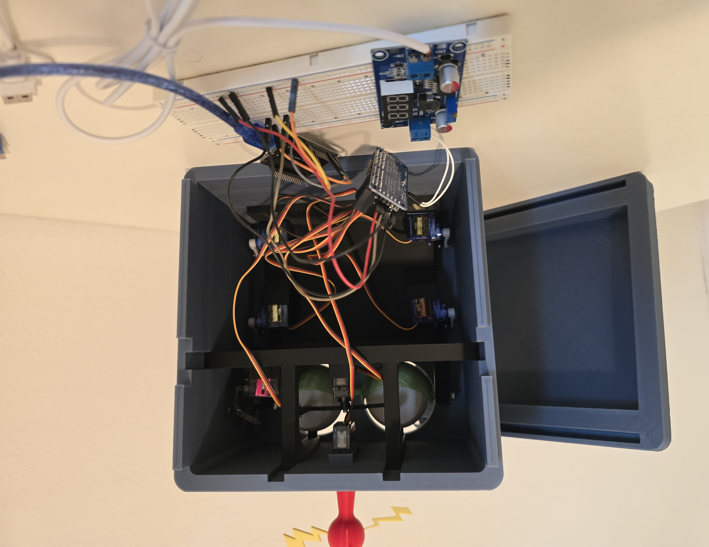

[View all final build photos](media/final_build/)

---

## System Architecture

The handheld ESP32 reads the physical controls, processes the inputs, and transmits the resulting control data wirelessly using ESP-NOW.

The ESP32 inside the head receives these commands, maps the inputs to the required servo ranges, and sends the corresponding PWM commands through the PCA9685 servo controller.

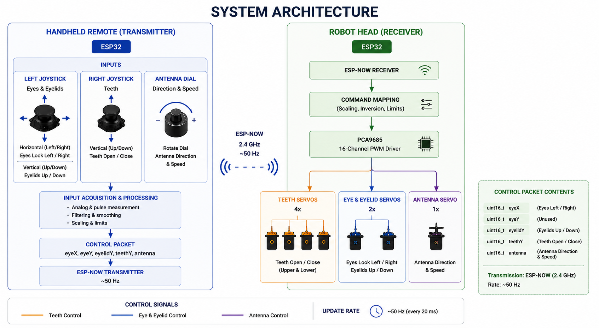

---

## Mechanical Design

The complete mechanical system was designed in **Autodesk Fusion 360**.

I began with original 2D character drawings and used them as the basis for developing the head geometry and internal mechanisms in CAD.

The design was developed iteratively:

1. Initial concept and 2D sketches
2. Mechanism development in Fusion 360
3. 3D printing
4. Physical assembly and testing
5. Identification of mechanical issues
6. CAD modification
7. New prototype
8. Final integration

The project includes custom mechanical systems for the teeth, eyes and eyelids, antenna, internal servo mounting, electronics packaging, and removable internal modules.

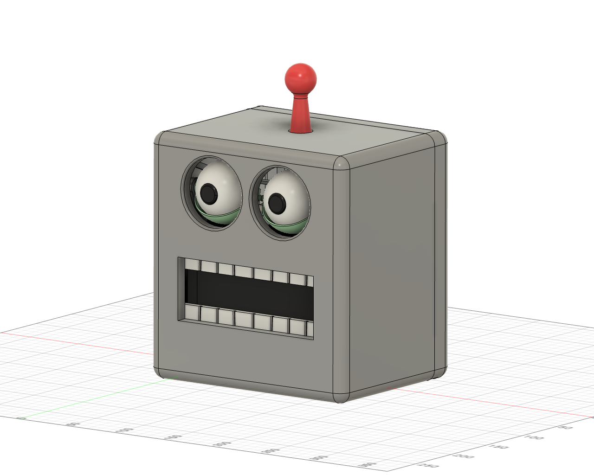

[View all CAD images](media/cad/)

---

## Teeth Mechanism Development

One of the main engineering challenges of the project was developing the teeth mechanism.

### Design Goal

The goal was to create a compact servo-driven mechanism that moves the upper and lower teeth vertically while keeping the visible movement as close to linear as possible.

The complete assembly also had to fit within the limited internal volume of the robot head.

### Engineering Challenge

Standard hobby servos naturally produce rotational motion, while the desired movement of the teeth was primarily translational.

I explored several mechanism geometries through sketches and CAD. Promising concepts were 3D printed, assembled, and physically tested before the geometry was modified for the next iteration.

### Early Design

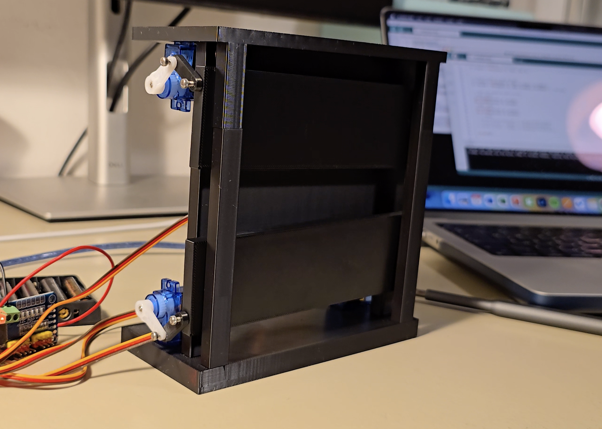

### Final Design

The final mechanism uses **four servo motors** to control the upper and lower teeth.

Because opposing servos are installed in mirrored orientations, their control directions are inverted in software so that the servos produce synchronized mechanical movement.

The complete teeth assembly was also designed as a removable module so it can be taken out of the head for testing, maintenance, or further development.

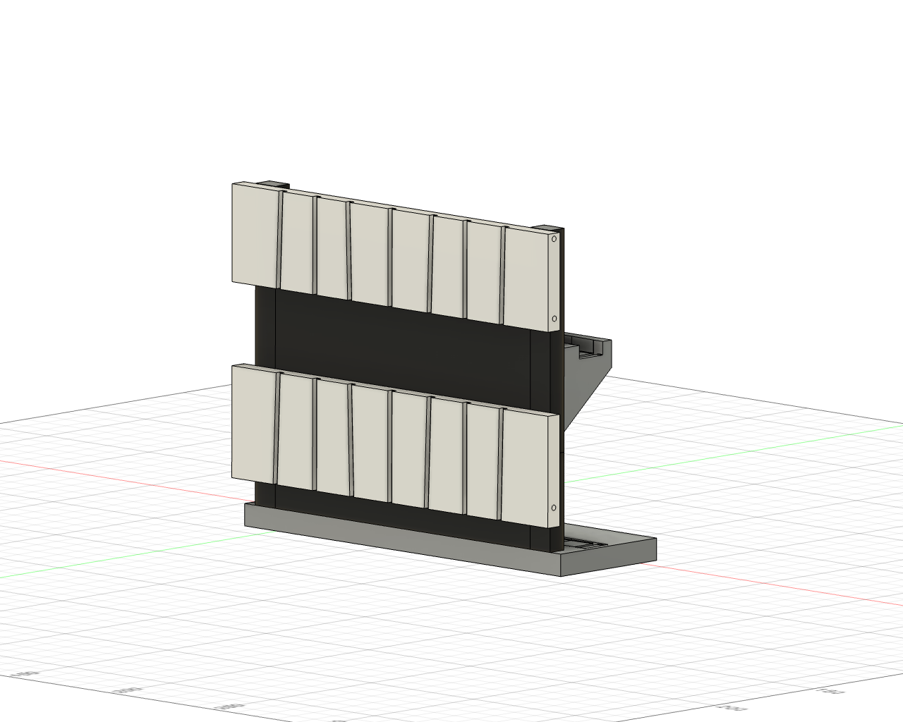

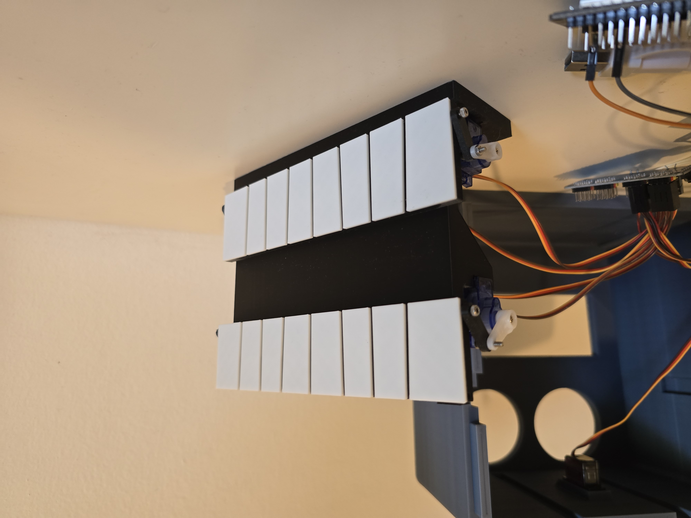

[View prototype and development images](media/prototypes/)

---

## Eye and Eyelid Mechanism

The eye assembly provides two movements controlled by the left joystick:

* Horizontal joystick movement controls the direction the eyes look
* Vertical joystick movement controls the eyelids

The mechanism was developed and packaged as a compact removable assembly that can slide inside the head.

The basic mechanism concept was informed by existing animatronic eye mechanisms I studied, while the CAD geometry, packaging, mechanical implementation, and integration into this project were designed independently.

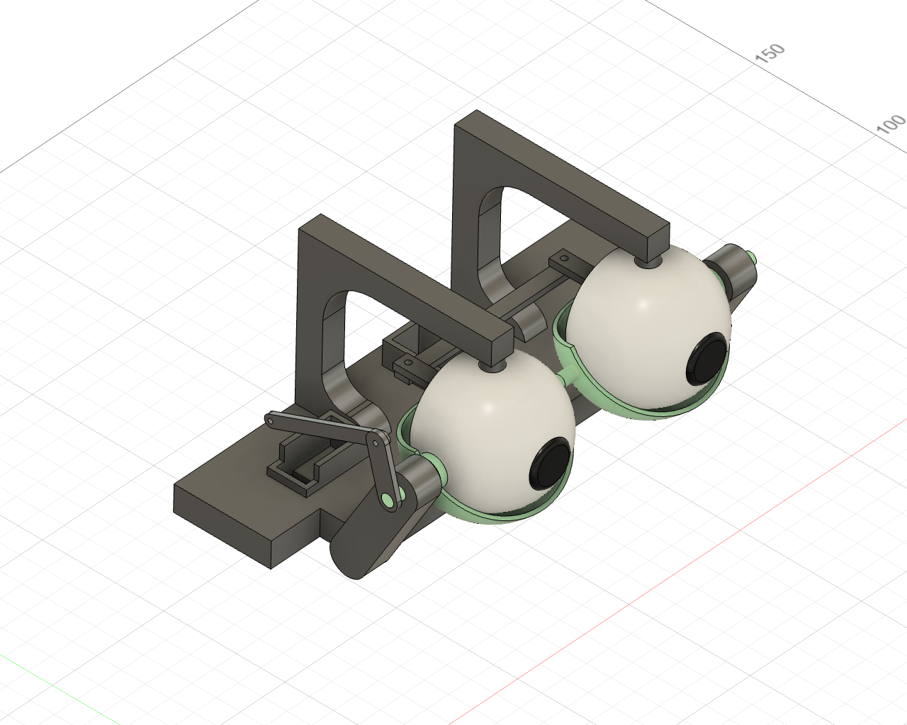

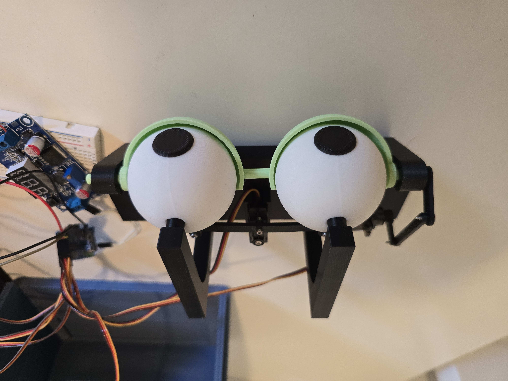

---

## Modular Internal Design

Serviceability was an important consideration during the mechanical design.

Rather than permanently integrating the internal mechanisms into the head shell, the major assemblies were designed so they could be independently removed.

This makes it easier to:

* Access individual mechanisms
* Replace or adjust servos
* Troubleshoot mechanical problems
* Test assemblies independently
* Continue iterating on individual mechanisms

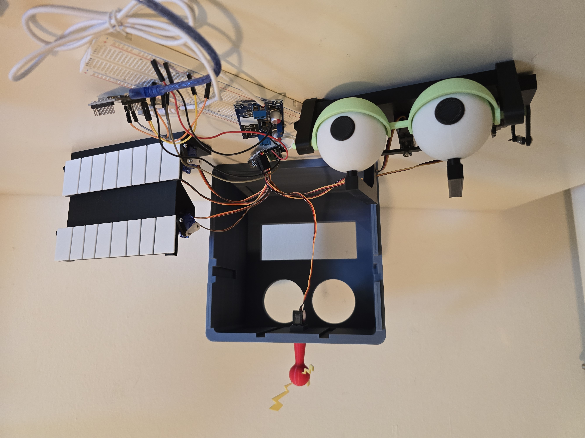

---

## Remote Controller

The handheld remote was designed in Fusion 360 to package the controls, ESP32, electronics, and power system into a self-contained controller.

It contains:

* Two analog joysticks
* Dedicated antenna control dial
* ESP32 microcontroller
* External USB power bank for portable operation

The ESP32 reads the user inputs, applies the required processing and filtering, creates the control packet, and transmits it wirelessly to the head using ESP-NOW.

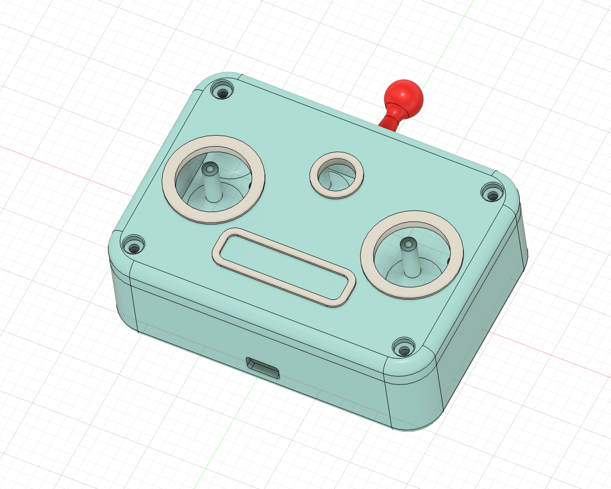

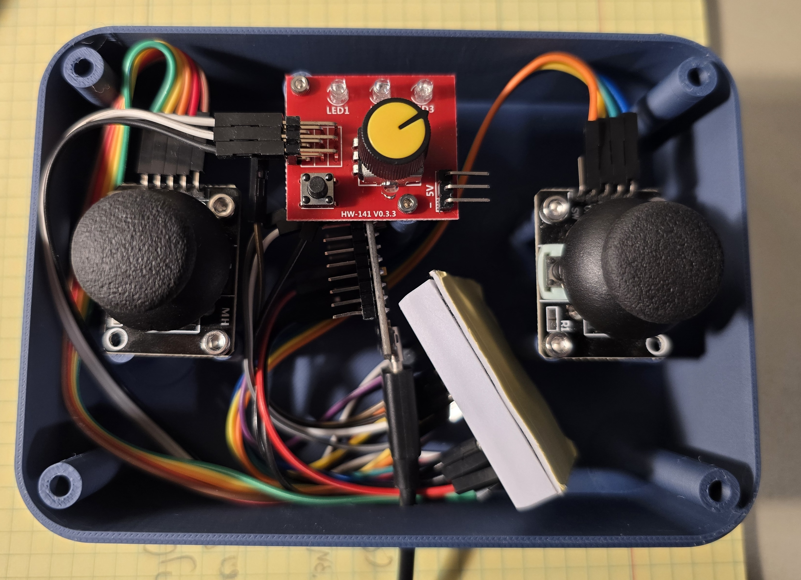

---

## Embedded Software

The embedded software is written in **C++ using the Arduino framework for ESP32** and is divided into two programs.

### Remote Controller Firmware

The remote firmware is responsible for:

* Reading joystick inputs
* Reading the antenna control signal
* Filtering the teeth-control input
* Creating the wireless control packet
* Transmitting commands using ESP-NOW
* Updating the control system at approximately 50 Hz

[View remote controller firmware](firmware/remote_controller/remote_controller.ino)

### Head Controller Firmware

The head firmware is responsible for:

* Receiving ESP-NOW control packets
* Mapping controller inputs to calibrated servo ranges
* Handling the mirrored servo arrangement in the teeth mechanism
* Generating servo commands
* Controlling the PCA9685 PWM driver
* Driving the eye, eyelid, teeth, and antenna mechanisms

[View head controller firmware](firmware/head_controller/head_controller.ino)

---

## Electronics and Power

The system uses two ESP32 microcontrollers: one in the handheld remote and one inside the robot head.

The remote ESP32 acts as the wireless transmitter, while the ESP32 inside the robot head acts as the receiver. Communication uses **ESP-NOW**, allowing direct peer-to-peer communication without requiring a Wi-Fi router.

Inside the robot head, a **PCA9685 16-channel PWM controller** generates the control signals for the seven servo motors.

An **LM2596 DC-DC buck converter** is used in the head's power system to regulate the external supply for the servo-control electronics. This allows the PCA9685 and servo system to operate from an external power source alongside the ESP32.

To make the complete project portable and fully wireless, the **robot head and handheld remote are each powered by external power banks**. This removes the need for a wired power connection during normal operation.

The complete control chain is therefore:

**Handheld Controls → Remote ESP32 → ESP-NOW → Head ESP32 → PCA9685 → Servo Mechanisms**

---

## Development Process

The project was developed through repeated mechanical, electronic, and software prototyping rather than from a single finalized design.

The overall process was:

**Original 2D concept → Mechanical sketches → Fusion 360 CAD → 3D printing → Physical testing → Design iteration → Electronics integration → Embedded software → Wireless control → Full-system testing**

Several parts of the project went through multiple iterations, particularly the teeth mechanism and the integration of the removable internal assemblies.

### Early Combined Mechanism Testing


### Remote and Head Integration Testing

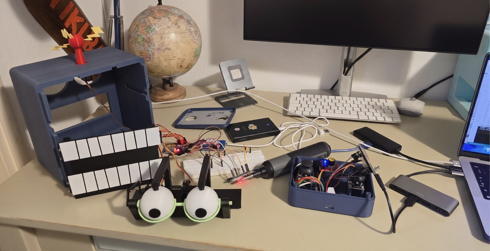

[View all development images](media/prototypes/)

---

## Tools & Technologies

### Mechanical Design & Prototyping

* Autodesk Fusion 360
* 3D CAD
* FDM 3D printing
* Mechanical prototyping
* Iterative mechanism development

### Embedded Systems

* ESP32
* C++
* Arduino framework
* PCA9685 PWM servo controller
* LM2596 DC-DC buck converter
* Analog joystick inputs
* Interrupt-based pulse measurement
* Servo motor control

### Communication & Control

* ESP-NOW
* Wireless peer-to-peer communication
* Input filtering and smoothing
* Servo position mapping
* ~50 Hz control updates

---

## Project Media

For additional project images:

* [CAD and mechanical design](media/cad/)
* [Final build and mechanisms](media/final_build/)
* [Prototypes and development](media/prototypes/)
* [System architecture](docs/system_architecture.png)

---

## Repository Structure

```text
animatronic-robot-head/
│
├── README.md
│
├── docs/
│   └── system_architecture.png
│
├── firmware/
│   ├── head_controller/
│   │   └── head_controller.ino
│   └── remote_controller/
│       └── remote_controller.ino
│
└── media/
    ├── cad/
    ├── final_build/
    └── prototypes/
```

---

## Project Status

The animatronic robot head is fully operational and can be controlled wirelessly using the custom handheld remote.

The current system provides control of:

* Eye direction
* Eyelid position
* Teeth opening and closing
* Antenna rotation direction and speed

Further mechanical and software development may be added as the project continues.

---

## Usage

This repository is published for **portfolio and demonstration purposes**.

No open-source license is currently granted for the source code or project files.
