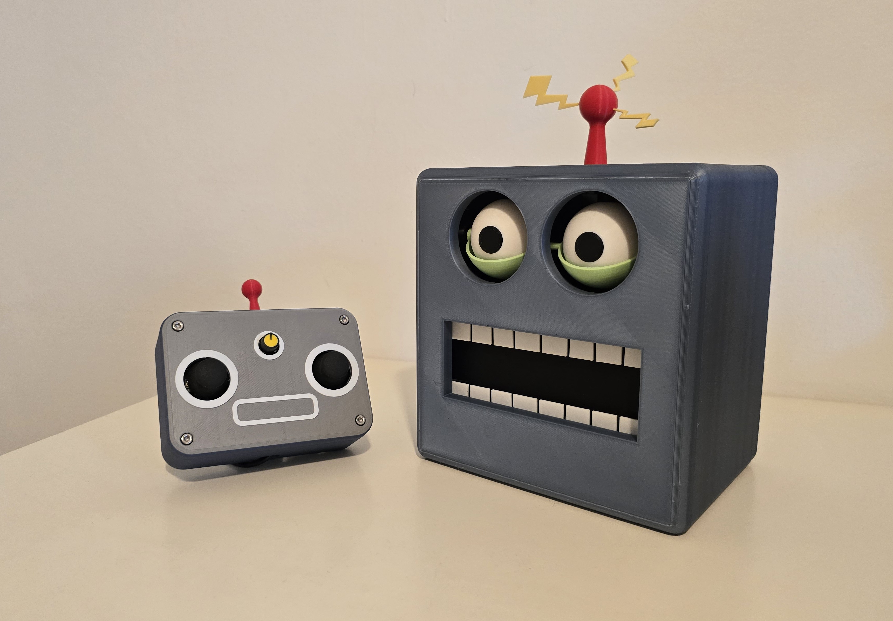

# Animatronic Robot Head

A fully functional wireless animatronic robot head designed and built from scratch as an independent robotics and mechanical prototyping project.

The project combines custom mechanical design, iterative 3D printing, embedded C++ development, electronics integration, wireless communication, and servo-based motion control.

All major mechanical components were designed in Autodesk Fusion 360 based on my original 2D concepts and developed through multiple physical prototypes.

## Demo

[Watch the robot in operation](YOUR_VIDEO_LINK)
